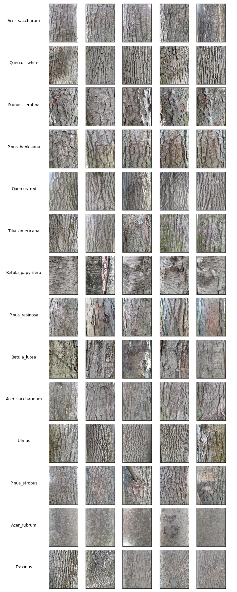

# Tree bark classifier

This directory contains code and images to build, train, and evaluate a convolutional neural network (CNN) that classifies images of tree bark. This project was a lot of fun to make: I took over 1600+ pictures of 100+ trees to make the dataset in the beautiful fall weather of Wisconsin. In addition to being enjoyable, this project touched on several key issues in machine vision and classification, including data augmentation, problems associated with imbalanced class sizes, and proper model selection and validation. 

The Jupyter notebook contains details on the dataset and a full walk-through of how the model is built and trained with data augmentation. The subdirectories in this repository are

- **logs**: Directory that stores the training history of each model in CSV format.
- **model_weights**: Contains the weights for the trained models. Unfortunately, the sizes of the hdf5 files that result are quite large, so I omitted those.
- **dataset200**: The image dataset. Each image is reduced in resolution to have a width of 200 pixels; the height is set so that the original height:width ratio is kept constant. Note that this will have to be uncompressed prior to running the Jupyter notebook. The image below shows image-examples of each tree class. 

